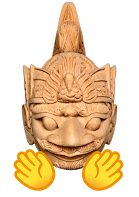

## Indonesian AI Research 🇮🇩

<figure markdown>
  { align=center }
</figure>

We are a team of Machine Learning enthusiasts who love to experiment with the latest state-of-the-art technology and publish the result as an Open-Source product.

We built this website to encourage further advancements on the field of all things related to Indonesian Artificial Intelligence. We aim to gather existing models, datasets, and tools which were developed by various parties and share them here.

## Links

- [Our Projects](../projects)
- [NLP Resources](../resources)
- [HuggingFace 🤗 Organization](https://huggingface.co/indonesian-nlp/)
- [Github Organization](https://github.com/indonesian-nlp/)

## Contributors

