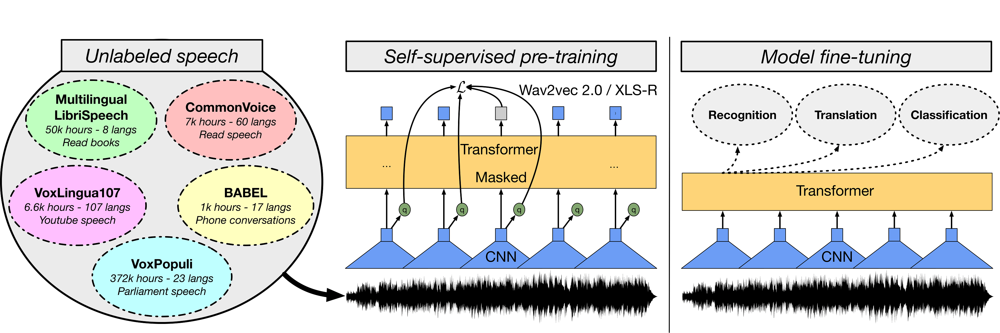
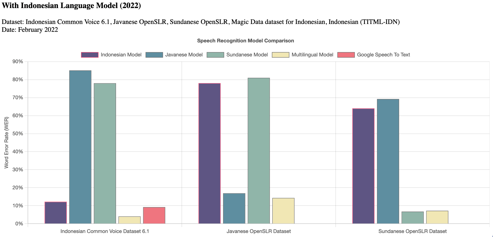

# Projects

## Indonesian Automatic Speech Recognition using Wav2Vec2

<figure markdown>
  { loading=lazy }
  <figcaption>XLS-R by Arun Babu, Changhan Wang, Andros Tjandra, et al.</figcaption>
</figure>

We fine-tuned an Indonesian ASR model using wav2vec2 on the Indonesian common voice dataset. On the test subset of Indonesian Common Voice, our model achieved a Word Error Rate of 14.290. We released our model on the [Hub](https://huggingface.co/indonesian-nlp/wav2vec2-large-xlsr-indonesian).

## Multilingual Speech Recognition for Indonesian Languages

<figure markdown>
  { loading=lazy }
  <figcaption>Multilingual ASR Performance by <a href="https://github.com/indonesian-nlp/multilingual-asr">Cahya Wirawan</a>.</figcaption>
</figure>

We built a Multilingual Speech Recognition model for Indonesian, Javanese and Sundanese. On the test subset of Indonesian Common Voice 7, our model achieved a Word Error Rate of 4.492. We also provide a [live demo](https://huggingface.co/spaces/indonesian-nlp/multilingual-asr) to test the model. We released our model on the [Hub](https://huggingface.co/indonesian-nlp/wav2vec2-indonesian-javanese-sundanese).

## Indonesian GPT2 and its Applications

<figure markdown>
  { loading=lazy }
  <figcaption>GPT-2 Illustrated by <a href="https://jalammar.github.io/illustrated-gpt2/">Jay Alammar</a>.</figcaption>
</figure>

We pre-trained three Indonesian GPT-2 models ([small](https://huggingface.co/flax-community/gpt2-small-indonesian), [medium](https://huggingface.co/flax-community/gpt2-medium-indonesian), and large) on Indonesian subsets of OSCAR, mC4 and Wikipedia (29GB of text data). We then further fine-tuned these models to various applications, such as [story generation](https://huggingface.co/cahya/gpt2-medium-indonesian-story), [academic journal abstract generation](https://huggingface.co/Galuh/id-journal-gpt2), and [chatbots](https://huggingface.co/cahya/gpt2-small-indonesian-personachat). We provide a [live demo](https://huggingface.co/spaces/indonesian-nlp/gpt2-app) to test these models.

## Image Captioning using CLIP and Marian

<figure markdown>
  { loading=lazy }
  <figcaption>OpenAI CLIP by Radford et al..</figcaption>
</figure>

We built an Indonesian image captioning model using [CLIP](https://huggingface.co/transformers/model_doc/clip.html) as the visual encoder and [Marian](https://huggingface.co/transformers/model_doc/marian.html) as the textual decoder on datasets with Indonesian captions. We provide a [live demo](https://huggingface.co/spaces/flax-community/indonesian-image-captioning) to test these models.
